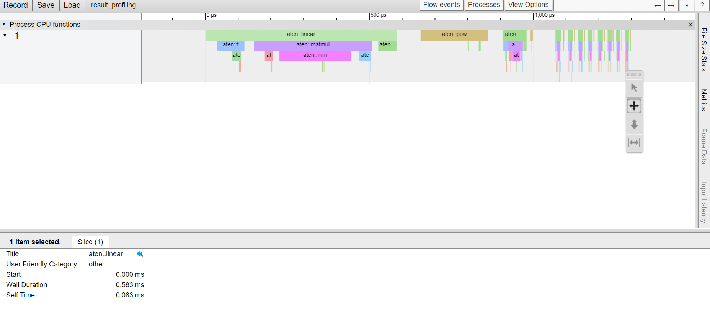

Today we will dive into torch.autograd module, one of them most important 
under the hood PyTorch's module. It implements automatic differentiation of arbitrary
scalar valued functions.

<p> <br> </p>

# Table of contents:

- How to calculate gradients ?
- How to locally disable gradients ?
- How to measure performance ?

<p> <br> </p>

# How to calculate gradients ?

Torch.autograd performs automatic differentiation using two different modes: 
reverse mode and forward mode. 

The popularity of reverse mode in deep learning comes from the fact that in general the
input dimensionality is higher than the output dimensionality. But in a general case,
for any $$f: \mathbb{R}^n \rightarrow \mathbb{R}^m$$, the reverse mode should be
used if and only if $$n>>m$$, otherwise if $$n<<m$$, forward mode is more performant.

The reason behind is the order we multiply Jacobian matrices in the chain rule. 
Indeed, considering real function f and g such that 
$$f: \mathbb{R}^{n_0} \rightarrow \mathbb{R}^{n_1}$$ and 
$$g: \mathbb{R}^{n_1} \rightarrow \mathbb{R}^{n_2}$$ where 
$$(n_0,n_1,n_2) \in \mathbb{N}^3$. Then, if we consider the derivative of 
$$y= f \circ g$$ on $$x \in \mathbb{R}^{n_0}$$, we have:

$$\frac{\partial y}{\partial x}(x) = 
\frac{\partial y}{\partial g}(g(x)).\frac{\partial g}{\partial f}(f(x)).\frac{\partial f}{\partial x}(x)$$

In multi-dimensional space, we need to compute Jacobian matrix of different functions. 
To recall, the Jacobian matrix of $f: \mathbb{R}^n \rightarrow \mathbb{R}^m$ is defined by:
$$J_f=
\begin{bmatrix}
\frac{\partial f_1}{x_1} ... \frac{\partial f_1}{x_n} \\ 
...\\
\frac{\partial f_m}{x_1} ... \frac{\partial f_m}{x_n}
\end{bmatrix}
$$

An important property is derived from the chain rule. 
For any $$f: \mathbb{R}^{n_1} \rightarrow \mathbb{R}^{n_2}$$ and 
$$g: \mathbb{R}^{n_0} \rightarrow \mathbb{R}^{n_1}$$ two real functions:
$$J_{f\circ g} = \underset{n_2 \times n_1}{J_{f}(g)}.\underset{n_1 \times n_0}{J_g}$$

This implies that we can rewrite the Jacobian matrix of a composition as a product of two matrices. If we have a composition of several functions, we have a matrix product. However, the optimised way of calculating the matrix product is not always straightforward, it depends on the dimensions of the matrix. If we multiply matrices from right to left, we perform forward AD, otherwise if we multiply matrices from left to right, we perform backward AD.

### Example
Let us calculate the gradient of a two layer MLP written as functions defined by $$h=f_3 \circ f_2 \circ f_1$$ where $$f_1: \mathbb{R}^{n_0} \rightarrow \mathbb{R}^{n_1}$$, $$f_2: \mathbb{R}^{n_1} \rightarrow \mathbb{R}^{n_2}$$, $$f_3: \mathbb{R}^{n_2} \rightarrow \mathbb{R}^{n_3}$$ such that $$\forall i \in \{1,2,3\}, \forall x\in \mathbb{R}^{n_{i-1}}, f_i(x)=x.W_i^T + b_i$$ where $$\forall i \in \{1,2,3\},  W_i:=(w_{k,p}^i)_{(k,p) \in [[1,...,n_i]] \times [[1,...,n_{i-1}]]} \in \mathbb{R}^{n_i \times n_{i-1}}, b_i\in \mathbb{R}^{n_i}$$.

We have:
$$\forall i \in [[1,...n_0]], \frac{\partial f_1}{\partial x_i} = \frac{\partial x.W_{1}^{T}}{\partial x_i} = L_i^{*1}$$

Hence:
$$
J_{f_1}(a) = (L_1^{*1}, ..., L_{n_0}^{*1}) = 
(C_1^{1}, ..., C_{n_0}^{1}) = W_1 \in \mathbb{R}^{n_1 \times n_0}
$$

Using the chain rule, 

$$J_h(a) =J_{f_3 \circ f_2 \circ f_1}(a)=
J_{f_3}(f_2 \circ f_1(a)).J_{f_2}(f_1(a)).J_{f_1}(a) =
W_3. W_2 . W_1
$$

So the Jacobian is the product of the three weight matrices. We can calculate it using from left to right (reverse mode) or from right to left (forward mode). 

## Reverse mode

In PyTorch, reverse mode automatic differentation is the by default mode.
To calculate gradients, *torch.autograd* contains two main functions: 
- *backward()*: convenient when working with a torch.nn model since 
it does not require the user to specify which Tensors we want the gradient for. It adds a *.grad* field to the leaf tensors.  
- *grad()*: does not add a grad field and requires to specify 
the Tensors we want the gradients for.

### Theory 

To perform reverse AD, PyTorch records a computation graph containing all of the 
operations to go from inputs to outputs. It gives us a directed acyclic graph 
whose leaves are the input tensors and roots are the output tensors. The graph is 
created in forward pass, while gradients are calculated in backward pass using
the computation graph.

### Example:
We continue the theorical example of the composition of three nested linear layers
to verify that the Jacobian of the composition is the product 
of the weight matrices. To do this, we can either use the *torch.autograd.grad()*
or *torch.autograd.backward().* 

Let us begin with "backward". According to the documentation, it
computes the sum of gradients with respect to graph leaves. We note that it 
has an argument called *grad_tensors* specifying the gradient of the output.
It multiplies the result on the left by *grad_tensors*. If we note it *G*
and $$f$$ the function we are calculating the jacobian, then the result will 
of *torch.autograd.backward* is: 
$$ G . J_f $$

For instance, if $$G$$ is equals to a tensor full of one, we have:

$$ (1, ... , 1) . J_f = 
\Big(\sum_{i=1}^{m} \frac{\partial f_i}{x_j} \Big)_{j \in \{1,...,n\}}$$

In practice, 
```python
# Imports:
import torch
from torch import nn

# Main:
in_f, inter_f, out_f=3,128,2

# Setup
x=torch.arange(in_f, dtype=torch.float32, requires_grad=True)
lin_in, lin_inter, lin_out=(nn.Linear(in_f,inter_f), 
                            nn.Linear(inter_f, inter_f), 
                            nn.Linear(inter_f, out_f))
model=nn.Sequential(lin_in, lin_inter, lin_out)

# Forward
y= model(x)
grad_output=torch.ones(out_f)

# Backward: sum of gradients
torch.autograd.backward(y, grad_tensors=grad_output)
jacob_sum=x.grad

# Sanity check
prod=lin_out.weight @ lin_inter.weight @ lin_in.weight # W_3.W_2.W_1
torch.allclose(jacob_sum, torch.sum(prod, dim=0)) # Equality !
```

The *torch.autograd.grad()* counterpart is really close to the previous implementation
and rather straightforward:

```python
# Change this
# torch.autograd.backward(y, grad_tensors=grad_output)
# jacob_sum=x.grad
# By
jacob_sum=torch.autograd.grad(y, x, grad_outputs=grad_output)
``` 

## Forward mode

PyTorch 1.12 has a beta API implementing forward mode AD. It contains three 
main functions:
- foward_ad.dual_level(): a context manager ensuring that all dual tensors created inside
will have their tangents destroyed upon exit. Convenient to avoid confusing tangents
from different computations.
- foward_ad.make_dual(): create a dual tensor associating a primal tensor with a 
dual tensor. The name comes from the dual number theory. 
- foward_ad.unpack_dual(): unpacks a dual tensor giving its Tensor value and its forward
AD gradient.

### Theory

We have already explained that the theorical difference between reverse and forward mode is 
the way we compute matrix product. In practice, we can not use the 
same pipeline, i.e create a computational graph and backpropagate. To implement
forward AD, we need a bit of dual number theory.


Let us write any dual number $$x=a+b. \epsilon$$ where $$\epsilon^2=0$$. When we apply, 
for any real function, the Taylor series on a dual number, we have: 
$$f(a+b\epsilon)=\sum_{n=0}^{\infty} \frac{f^{(n)}(a) b^n \epsilon^n }{n!} = f(a)+b.f^{'}(a).\epsilon$$
since $$\epsilon^2=0$$.

Hence, for any real function g, we have:
$$f(g(x)) = f(g(a) + b.g^{'}(a)\epsilon)= f(g(a)) + b.g^{'}(a).f^{'}(g(a)).\epsilon$$

Moreover, we have for any real function f and g:
$$f(x).g(x)=(f(a)+b.f^{'}(a).\epsilon).(g(a)+b.g^{'}(a).\epsilon)=f(a).g(a) + 
(b.f^{'}(a).g(a)+f(a).b.g^{'}(a)).\epsilon$$

The previous results are sufficient to calculate derivatives. For instance, if 
$$f: \mathbb{R} \rightarrow \mathbb{R}$$ such that $$\forall x \in \mathbb{R}, f(x)=x^2.sin(x)$$.
If we want to calculate the derivative on 3, we do the following calculus:
$$x=3+1.\epsilon, x^2=9+6.\epsilon, sin(x)=sin(3)+cos(3).\epsilon$$
$$f(x)=x^2.sin(x)=(9+6.\epsilon).(sin(3)+cos(3)\epsilon)= 9.sin(3)+ (9.cos(3)+6.sin(3)). \epsilon$$

Hence, $$f(3)=9.sin(3)$$ and $$f^{'}(3)=(9.cos(3)+6.sin(3))$$.

### Example
We use the same example as before and keep the notations of the official 
introductory notebook: primal (input, previously "x") and
tangent (input derivatives). Using the same
notations as before, tangent *T* applies the following transformation 
on the Jacobian: 
$$J_f . T$$

Thus, if $$T$$ is equals to a tensor full of one, we have:

$$ J_f . 
\begin{pmatrix}
1 \\
... \\
1 
\end{pmatrix} = 
\Big(\sum_{j=1}^{n} \frac{\partial f_j}{x_i} \Big)_{i \in \{1,...,m\}}$$


```python
import torch
from torch import nn

# Params
in_f, inter_f, out_f=3,128,2

# Setup
x=torch.arange(in_f, dtype=torch.float32)
tangent = torch.ones(in_f)
lin_in, lin_inter, lin_out=(nn.Linear(in_f,inter_f), 
                            nn.Linear(inter_f, inter_f), 
                            nn.Linear(inter_f, out_f))
model=nn.Sequential(lin_in, lin_inter, lin_out)

# Forward
with fwAD.dual_level():
    dual_input = fwAD.make_dual(x, tangent)
    y = model(dual_input)
    jvp = fwAD.unpack_dual(y).tangent

# Sanity check
prod=lin_out.weight @ lin_inter.weight @ lin_in.weight # W_3.W
torch.allclose(jvp, torch.sum(prod, dim=1)) # Equality !
```

The result is the same as before !

<p> <br> </p>

## Reverse AD vs forward AD

In the introduction, I presented the interest of the AD forward method when the 
dimensionality of the output space is higher than that of the input space. It is
time to verify the statement in coding. 

```python
N,M=1024,16

x=torch.randn(N)
model=nn.Linear(N,M)

# Forward AD
primal=x.clone()
tangents=torch.eye(N)

start=time.perf_counter()
jacob_fwd=[]
for tangent in tangents:
    with fwAD.dual_level():
        dual_input = fwAD.make_dual(x, tangent)
        y = model(dual_input)
        jvp = fwAD.unpack_dual(y).tangent
    jacob_fwd.append(jvp)
jacob_fwd=torch.stack(jacob_fwd)
end=time.perf_counter()

print(f'Forward AD: {end-start:>21.5f}s shape {jvp.shape}')

# Reverse AD
inp=x.clone().requires_grad_(True)
gradients=torch.eye(M)

start=time.perf_counter()
y=model(inp)
jacob_rev=[]
for grad in gradients:
    torch.autograd.backward(y, grad_tensors=grad, retain_graph=True)
    jacob_rev.append(inp.grad)
jacob_rev=torch.stack(jacob_rev)
end=time.perf_counter()
print(f'Backward AD: {end-start:>20.5f}s shape {inp.grad.shape}')

torch.allclose(jacob_rev, jacob_fwd.T)
```

One could use more advanced functions to criticise the use of 'for' loops. 
However, this code gives us a first impression of the time difference and is 
not intended to be as optimised as possible. Nonetheless, results are striking.
The difference in computation time between the two approaches is of several 
magnitudes depending on whether the final dimension is greater than the initial one.

This result is very important because if I had said that the popularity of 
reverse AD in deep learning was due to the fact that the output dimension is usually 
smaller than the input dimension, there are problems and architectures (encoder) 
that do not verify this result. 

One can hope that one day the optimisation will intelligently choose which mode 
to use according to the intermediate spaces of the architecture.

## Optimized comparison

The last code snippet, give us a hint about the best mode depending on the 
situation. However, it was a bit tedious. That is why, PyTorch has
implemented optimized functions in *torch.autograd.functional* to calculate 
Jacobians (1st order) and Hessians (2nd order) in a beta API. 
PyTorch is trying to catch up with JAX on the optimized
calculation of high-order gradients.

### Example:

For instance, instead of using a for loop to calculate jacobian, 
we can use a one-line function. The results are faster but the conclusion is the same:
the time difference depends on the distance between the dimensions.

```python
N,M=16,1024

x=torch.randn(N)
model=nn.Linear(N,M)

# Forward 
start=time.perf_counter()
jacob_fwd=torch.autograd.functional.jacobian(model, x, vectorize=True, strategy='forward-mode')
end=time.perf_counter()
print('Time: {:10.3f}'.format(end-start))

# Reverse
start=time.perf_counter()
jacob_rev=torch.autograd.functional.jacobian(model, x)
end=time.perf_counter()
print('Time: {:10.3f}'.format(end-start))

torch.allclose(jacob_rev, jacob_fwd)
```

<p> <br> </p>

# How to locally disable gradients ?

There are two common situations where we want to disable gradients: during inference
or using custom code. Different context manager help us to globally disable or 
enable gradient calculation and storage. There are three different context:
- grad mode: it is the by default mode and is the only mode in which *requires_grad*
takes effect. It is used when training models.
- no-grad mode (*torch.set_grad_enabled(False)* or *torch.no_grad()*): 
convenient to temporary disable the tracking of any operations 
requires to latter calculate gradients without having to set
*requires_grad* to False and then back to True. 
- inference mode (*torch.inference_mode()*): optimized version of no-grad mode 
disabling view tracking and version counter bumps. 
It is used in during data processing and evaluation.

**Note:**
- model.eval() is not a context manager. It only change the behaviour of modules
acting differently during training and evaluation (nn.Dropout, nn.BatchNorm2d)
- None of the context manager is available for forward AD.

<p> <br> </p>

# How to measure performance ?

## Profiling

Profiling code is really important to find code bottlenecks, check GPU memory, 
check CPU memory. PyTorch has implemented a profiler recording GPU and CPU events
with a simple context manager *torch.autograd.profiler.profile()*. 
It has many interesting arguments such as:
- enabled: allows to enable or not profiling. It is useful so that we do not 
have to comment on or uncomment the code, whether we want to profile it or not. 
- use_cuda: enables timing of CUDA event. 

```python
in_f, out_f=128,1
bool_profile=False

# Setup
x=torch.arange(in_f, dtype=torch.float32, requires_grad=True)
model=nn.Sequential(nn.Linear(in_f,out_f))

with torch.autograd.profiler.profile(enabled=bool_profile) as prof:
    for _ in range(10):
        y=model(x)       

if prof is not None:
    # Save profiling
    prof.export_chrome_trace('result_profiling')

    # Print table order by CPU time 
    print(prof.key_averages().table(sort_by="self_cpu_time_total"))
```


After profiling, we can print table in the terminal directly using a simple print
or after having grouped functions using *profiler.profile.key_averages*. Another
intersting tools is to save a trace of the profiling and to load it later in: *chrome://tracing*



---------------------------------
Ressources:

**Concepts:**
- [Understand AD](https://towardsdatascience.com/forward-mode-automatic-differentiation-dual-numbers-8f47351064bf)
- [Understand AD (2)](https://math.stackexchange.com/questions/2195377/reverse-mode-differentiation-vs-forward-mode-differentiation-where-are-the-be)
- [Mathematical aspects of AD](https://jingnanshi.com/blog/autodiff.html)

**Benchmark:**
- [Comparison between AD modes](https://leimao.github.io/article/Automatic-Differentiation/)
- [AD mode time comparison](https://leimao.github.io/blog/PyTorch-Automatic-Differentiation/)

**Notebooks:**
- [AD Notebook](https://pytorch.org/tutorials/intermediate/forward_ad_usage.html)
- [Autograd notebook](https://pytorch.org/docs/stable/notes/autograd.html#)